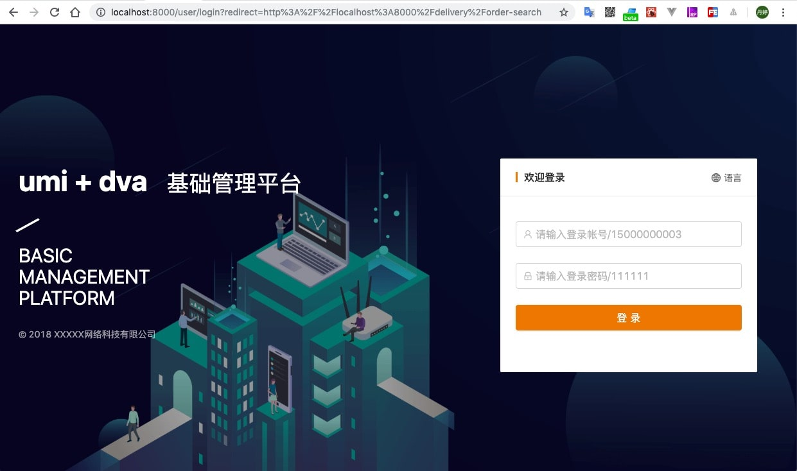
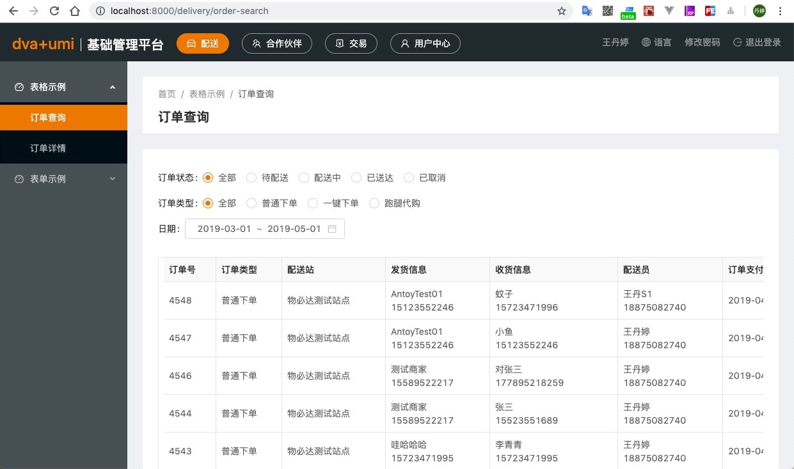

<h1 align="center">umi + dva 管理系统基础框架</h1>

<div align="center">已实现基础配置，可直接使用的基础管理系统模版框架</div>

<div align="center">

<p float="left">





</p>

</div>

## 技术栈

- 使用框架：[react](https://reactjs.org/)、[umi](https://umijs.org/zh/)、[dva](https://dvajs.com/)、[antd](https://ant.design/index-cn)
- 使用请求：[umi-request](https://github.com/umijs/umi-request/blob/master/README_zh-CN.md)
- 类型检查：[prop-types](https://www.npmjs.com/package/prop-types)
- 搭建环境：[eslint](https://eslint.org/)、[prettier](https://prettier.io/)、[stylelint](https://stylelint.io/)、[husky](https://www.npmjs.com/package/husky)、[lint-staged](https://www.npmjs.com/package/lint-staged)

## 特性

- **最新技术栈**：使用 React/umi/dva/antd 等前端前沿技术开发
- **国际化**： 内建业界通用的国际化方案 案例支持 中文/英文
- **快速上手**：可直接写业务代码

## 预览

克隆代码

```shell
  // Use SSH
  git clone git@github.com:wangdanting/dva-umi-system.git

  // Use HTTPS
  https://github.com/wangdanting/dva-umi-system.git
```

安装依赖

```shell
  cd dva-umi-system
  yarn install
```

运行代码

```shell
  yarn start
```

浏览器打开 `http://localhost:8000/`

## 开发

### 简单的路由配置

[使用配置式路由 ](https://umijs.org/zh/guide/router.html) `/config/router.config.js`

```javascript
[
  {
    path: '/user',
    routes: [
      { path: '/user', redirect: '/user/login' },
      { path: '/user/login', component: './User/Login' },
      { component: '404' },
    ],
  },
  {
    path: '/',
    component: '../layouts/BasicLayout',
    routes: [
      { path: '/', redirect: '/delivery/order-search' },
      {
        path: '/delivery',
        name: 'delivery',
        icon: 'dashboard',
        routes: [
          {
            path: '/delivery/order-search',
            name: 'orderSearch',
            component: './Delivery/Order/OrderSearch',
          },
          {
            path: '/delivery/order-detail',
            name: 'orderDetail',
            component: './Delivery/Order/OrderDetail',
          },
        ],
      },
    ],
  },
];
```

### 代理配置

在`config/config.js`文件中修改代理服务

```javascript
  proxy: {
    '/api': {
      target: 'https://wbd.api.t.jiabangou.com/',
      changeOrigin: true,
      secure: true,
    },
  },
```

### 业务

在 `/src/pages` 下建立业务文件

具体请看例子参考

### 状态管理

在`/src/models`下放状态管理文件，`namespace`命名则为引用的单词。👇下面为例子

```javascript
import login from '@/services/login';
export default {
  namespace: 'login',
  state: {
    loading: false, // 设置按钮载入状态
  },
  effects: {
    *login({ payload }, { call, put }) {
      yield put({
        type: 'setState',
        payload: {
          loading: true,
        },
      });
      const { result } = yield call(login, payload);
    },
  },
  reducers: {
    setState(state, { payload }) {
      return {
        ...state,
        ...payload,
      };
    },
  },
};
```

### 使用状态管理

```javascript
import { connect } from 'dva';

@connect(({ login }) => ({
  loading: login.loading,
}))
class Login extends PureComponent {
  handleSubmit = () => {
    const { dispatch } = this.props;

    //调用登录方法
    dispatch({
      type: 'login/login',
      payload: {},
    });
  };

  render() {
    const { loading } = this.props;
    return (
      <Button onClick={this.handleSubmit} loading={loading}>
        登录
      </Button>
    );
  }
}
export default Login;
```

### 存放请求services

在`/src/services`下创建文件，👇下面为例子

```javascript
import request from '@/utils/request';

export default async function login(payload) {
  return request('/api/bp/sessions/create', {
    method: 'post',
    params: payload,
  });
}
```

## 代码检测

添加了第三方钩子，如果代码不符合规范，`会不能提交代码`，你可在提交代码前可以运行👇以下命令行进行代码检测，`查看不规范的代码文件提示后进行修改`。

```shell
  yarn lint:fix
```